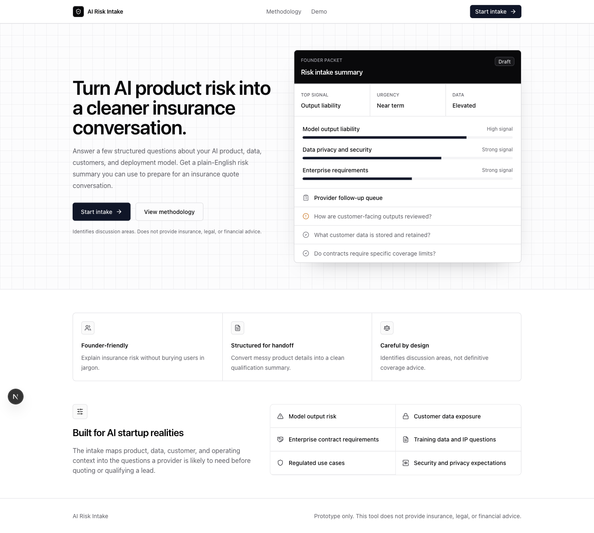
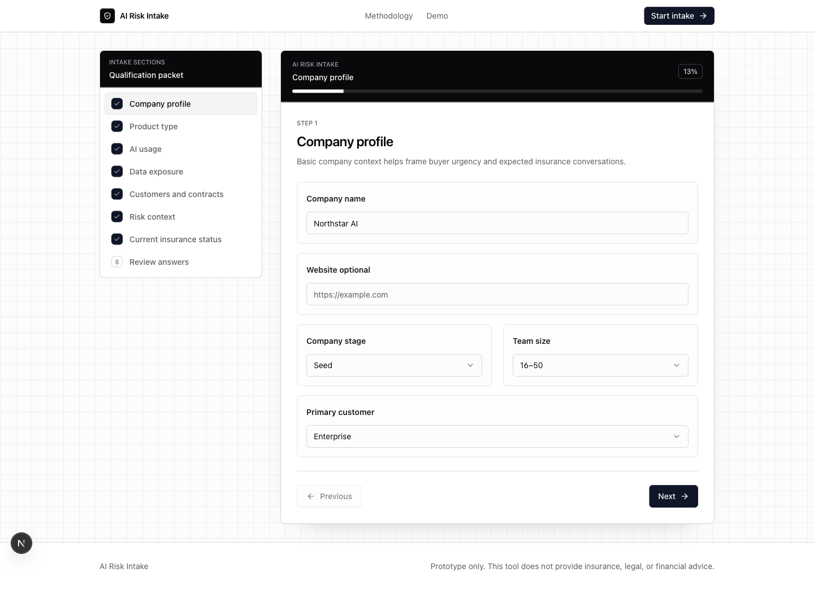
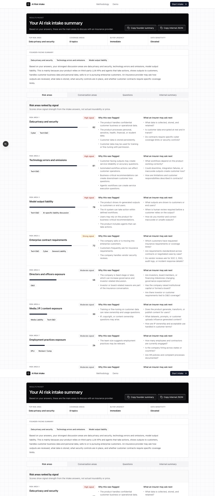

# AI Risk Intake

A structured intake prototype that helps AI startups translate product and data exposure into insurance-relevant risk signals.

AI Risk Intake is a Corgi-style startup insurance product prototype. It gives founders a focused way to describe their AI product, customer data usage, deployment model, contract pressure, and operating maturity before an insurance quote conversation.

The output is not advice. It is a founder-friendly preparation packet plus a structured internal handoff that a startup insurance team could use for lead qualification or routing.

## Problem

AI startup founders often enter insurance conversations with messy context:

- The product may rely on third-party LLM APIs, agents, fine-tuned models, or customer-uploaded data.
- Enterprise customers may ask for limits, certificates, security reviews, or specific policy categories.
- Founders may not know which details are relevant to an insurer.
- Internal GTM or underwriting handoff can lose nuance when product risk is described informally.

This prototype turns that context into a cleaner first conversation.

## Solution

The app guides a founder through a multi-step intake covering:

- Company profile
- Product type and decision reliance
- AI usage and automated actions
- Data exposure and security controls
- Customer contract requirements
- Risk context
- Current insurance status

At the end, it generates:

- Founder-facing risk summary
- Potential coverage conversation areas
- Questions an insurance provider may ask next
- Structured JSON-style internal handoff summary

## Features

- Multi-step intake wizard with validation
- LocalStorage persistence across refreshes
- Review step before results
- Deterministic rules-based risk scoring
- Ranked risk areas with drivers and follow-up questions
- Deduplicated coverage conversation areas
- Copy founder summary
- Copy internal JSON
- Browser-native PDF export from the results packet
- Local admin lead list for completed intake handoffs
- Optional broker/internal notes stored with the handoff summary
- Empty state when no completed intake exists
- Methodology page explaining category-level score drivers and limits
- Unit-tested risk scoring rules
- Responsive product UI for desktop and mobile

## Tech Stack

- Next.js App Router
- TypeScript
- Tailwind CSS
- shadcn-style Radix UI primitives
- React Hook Form
- Zod
- Lucide icons
- Framer Motion
- Sonner toast notifications

## Screenshots

### Landing Page



### Intake Wizard



### Results Summary



## Local Development

Install dependencies:

```bash
npm install
```

Run the development server:

```bash
npm run dev
```

Open:

```txt
http://localhost:3000
```

Run checks:

```bash
npm run lint
npm run typecheck
npm run test
npm run build
```

## Risk Methodology

The prototype uses deterministic local rules, not an AI model and not underwriting judgment.

Each risk category receives a score from 0 to 100 based on selected answers. Scores are grouped into signal bands:

- 0-24: Low signal
- 25-49: Moderate signal
- 50-74: Strong signal
- 75-100: High signal

Risk categories include:

- Model output liability
- Data privacy and security
- Enterprise contract requirements
- Technology errors and omissions
- Directors and officers exposure
- Employment practices exposure
- Media / IP / content exposure
- Regulatory or high-impact decision exposure
- Third-party dependency risk
- Operational maturity gaps

Coverage areas are shown only as conversation topics. They are not policy recommendations.

## Disclaimer

This is a prototype only. It does not provide insurance, legal, or financial advice. It does not determine actual insurability, coverage, limits, pricing, exclusions, or carrier appetite. A real insurance provider would need additional information before advising on or quoting any insurance product.

## Why This Matters for Corgi-Style Startup Insurance

AI startups introduce product and data questions that do not fit neatly into a generic quote form. A structured intake can help:

- Founders prepare clearer answers
- GTM teams qualify leads faster
- Insurance providers identify follow-up questions earlier
- Product, data, security, and contract context stay attached to the handoff

## Future Improvements

- Persist completed intakes to a backend
- Add analytics events for funnel drop-off analysis
- Add downloadable branded PDF templates with pagination controls
- Add broker-facing filters and status fields for the local admin list
- Add deeper methodology examples for edge cases and regulated use cases
